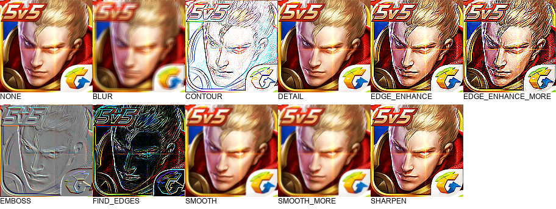

title: 记录
date: 2018.05.02
tags: day_day
---

### PIL

PIL是python语言写的图形处理库，日常工作中可以使用这个工具处理一些简单的工作。

* 批量修改图形尺寸
* 读取图片像素
* 切割图片，组合图片
* ...

在这里记录一下常用的方法

#### resize

im.resize(size, Image.ANTIALIAS) 转换尺寸的时候可以添加更多参数，来调节生成的图片的质量。

---
|参数值	|	含义	|
| :---- | :---- |
|Image.NEAREST| 低质量|
|Image.BILINEAR|	双线性|
|Image.BICUBIC| 	三次样条插值|
|Image.ANTIALIAS|	高质量 抗锯齿|

#### getpixel

im.getpixel((x, y))

#### filter

滤镜特效`im.filter(ImageFilter.BLUR)`[滤镜][1][滤镜][2]

效果如下：



|参数值	|	含义	|
| :-- | :-- |
|ImageFilter.BLUR | 模糊滤镜|
|ImageFilter.CONTOUR | 轮廓|
|ImageFilter.DETAIL | 细节滤镜|
|ImageFilter.EDGE_ENHANCE |	边界加强|
|ImageFilter.EDGE_ENHANCE_MORE |	边界加强(阀值更 大)|
|ImageFilter.EMBOSS |	浮雕滤镜|
|ImageFilter.FIND_EDGES |	边界滤镜|
|ImageFilter.SMOOTH |	平滑滤镜|
|ImageFilter.SMOOTH_MORE |	平滑滤镜(阀值更大)|
|ImageFilter.SHARPEN |	锐化滤镜|


```
from PIL import Image
from PIL import ImageFilter
from PIL import ImageFont
from PIL import ImageDraw
import math

im = Image.open("BIG.png")
out = im.copy().resize((152, 152), Image.ANTIALIAS)
out.save("NONE.png")

ImageFilter_KEYS = {
    "BLUR":ImageFilter.BLUR,
    "CONTOUR":ImageFilter.CONTOUR,
    "DETAIL":ImageFilter.DETAIL,
    "EDGE_ENHANCE":ImageFilter.EDGE_ENHANCE,
    "EDGE_ENHANCE_MORE":ImageFilter.EDGE_ENHANCE_MORE,
    "EMBOSS":ImageFilter.EMBOSS,
    "FIND_EDGES":ImageFilter.FIND_EDGES,
    "SMOOTH":ImageFilter.SMOOTH,
    "SMOOTH_MORE":ImageFilter.SMOOTH_MORE,
    "SHARPEN":ImageFilter.SHARPEN,
}

im = Image.open("NONE.png")
size = im.size

filters = ("NONE", "BLUR", "CONTOUR", "DETAIL", "EDGE_ENHANCE", "EDGE_ENHANCE_MORE", "EMBOSS", "FIND_EDGES", "SMOOTH", "SMOOTH_MORE", "SHARPEN")

count = len(filters)

column = int(math.floor(1024 / size[1]))
row = int(math.ceil(1.0 * count / column))

print column, row
height = size[1] + 20


image = Image.new('RGB', (size[0] * column, height * row), (255, 255, 255))
draw = ImageDraw.Draw(image)
font = ImageFont.truetype('Arial.ttf', 12)

for index in xrange(0, count):
    _filter_name = filters[index]
    _filter = ImageFilter_KEYS.get(_filter_name)
    out = im
    if _filter:
        out = im.copy().filter(_filter)

    y = int(math.floor(index / column))
    x = int(index - y * column)

    image.paste(out, (size[0] * x, height * y))
    draw.text((size[0] * x, height * y + size[1]), _filter_name, font=font, fill=(0, 0, 0), anchor=(0.5, 1))

image.save("all.png")
```


[1]:https://blog.csdn.net/icamera0/article/details/50708888 "滤镜"
[2]:https://www.cnblogs.com/sopic/p/4538052.html "滤镜"
